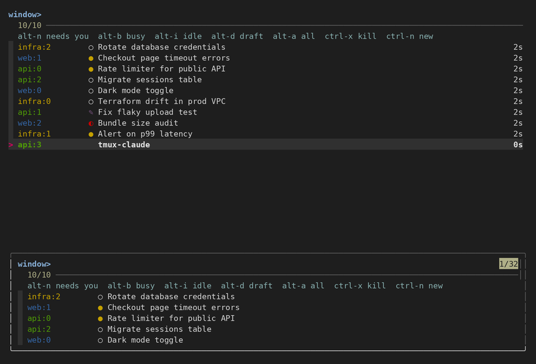
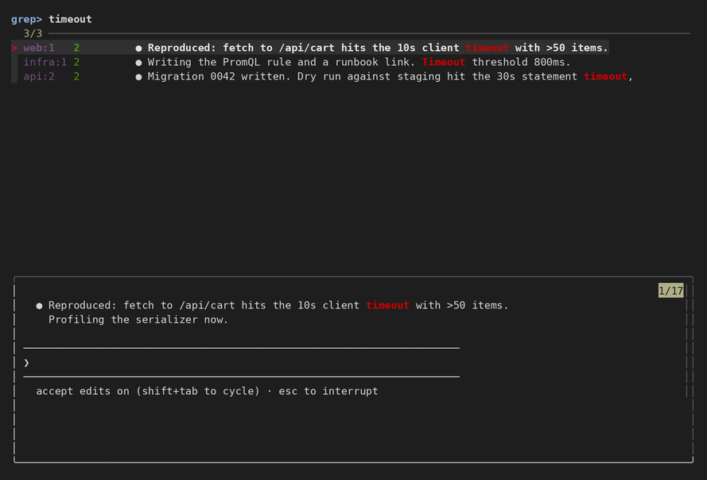

# tmux-claude

Running twenty [Claude Code](https://docs.anthropic.com/en/docs/claude-code) sessions in tmux
windows all named `claude`? tmux-claude names each window after its task, shows which ones are
busy, idle, or waiting on a prompt you half-typed, and gives you Emacs-style buffer navigation
over all of them: fuzzy switch, grep every scrollback, jump back.

Everything except the busy/idle detection is plain tmux and works for any window.

- **`prefix w`** – fuzzy window picker (think `ivy-switch-buffer`). Type to narrow, Enter to jump.
  Rows show session, what Claude is doing (`◐` needs you, `●` busy, `✎` unsent draft, `○` idle), task name, and age.
  Ordered by last visited; the current window is dimmed and starts under the cursor, so Enter alone just closes the picker. Filter with `alt-n` / `alt-b` / `alt-i` / `alt-d` / `alt-a`,
  kill with `ctrl-x`, `ctrl-n` opens a new window in the highlighted window's directory and starts `claude`.
- **`prefix g`** – grep the scrollback of *every* pane at once (think `multi-occur` / `counsel-rg`).
  Live results with context preview. Enter jumps to that window and scrolls to the line.
- **`prefix b`** – back to the previously visited window, across sessions.
- **Window names = Claude's task title.** Claude Code writes the task summary into the pane title;
  tmux-claude makes the window name follow it, so the status bar and every native tmux picker show
  "Fix flaky upload test" instead of `claude`.
- **Optional status bar**: windows that need you red, busy yellow, drafts magenta, counts on the right.





Screenshots are generated from mock data by `demo/mock.sh` on a throwaway tmux server.

## Requirements

tmux ≥ 3.3 (`display-popup -e`), [fzf](https://github.com/junegunn/fzf) ≥ 0.36, [ripgrep](https://github.com/BurntSushi/ripgrep) ≥ 13, bash, awk.

## Install

With [TPM](https://github.com/tmux-plugins/tpm):

```tmux
set -g @tmux_claude_status on          # optional, see below
set -g @plugin 'helinwang/tmux-claude'
```

Manually:

```sh
git clone https://github.com/helinwang/tmux-claude ~/.tmux/tmux-claude
```

```tmux
# ~/.tmux.conf
set -g @tmux_claude_status on          # optional
run-shell ~/.tmux/tmux-claude/tmux-claude.tmux
```

Then `tmux source-file ~/.tmux.conf`. No restart needed. Existing windows pick up the new
naming on their next title change; to rename them all right away:

```sh
for w in $(tmux list-windows -a -F '#{session_name}:#{window_index}'); do
  tmux set -w -t "$w" automatic-rename off \; set -w -t "$w" automatic-rename on
done
```

## Options

Set before the `run-shell` / `@plugin` line.

| option                  | default | effect                                                                 |
|-------------------------|---------|------------------------------------------------------------------------|
| `@tmux_claude_key_win`  | `w`     | window picker                                                          |
| `@tmux_claude_key_grep` | `g`     | grep all panes                                                         |
| `@tmux_claude_key_last` | `b`     | previously visited window                                              |
| `@tmux_claude_key_tree` | `W`     | native `choose-tree`, with the duplicated title suffix removed         |
| `@tmux_claude_rename`   | `on`    | window name follows the pane title                                     |
| `@tmux_claude_status`   | `off`   | rewrite `window-status-format` / `status-right` with states and counts |

Environment: `TMUX_CLAUDE_GREP_LINES` (default 5000) lines of scrollback per pane for `prefix g`.

## How it works

Nothing exotic. `display-popup -E` runs a script in a floating pane; fzf draws the UI;
`tmux list-windows -F` and `capture-pane -p` feed it; `switch-client -t session:index` jumps.

- **State** (`bin/tmux-claude-state`): reads the last few lines of each pane. A permission prompt,
  question menu, or `[y/n]` means it needs you; `esc to interrupt` in the footer means busy; a `❯`
  prompt with text after it means an unsent draft; a bare prompt means idle. Stored in the window
  option `@state` for the status bar.
- **Last visited**: a `pane-focus-in` hook stamps an epoch into `@visited` on every window you land in.
  The picker sorts by it; `prefix b` takes the second entry.
- **Grep**: dumps every pane's scrollback to a temp dir, then re-runs `rg` on each keystroke
  (`fzf --disabled --bind change:reload`). About 0.4 s for 80 panes × 5000 lines.

Works fine without Claude Code: every window still gets a row, just with a blank state icon.

## Native alternatives

If you only want one thing, tmux already has some of it:

- `prefix f` – `find-window`: plain-text filter over window names, titles, and *visible* pane content.
- `choose-tree` (tmux's `prefix w`, moved to `prefix W` here): `C-s` searches names, `f` takes a format expression, not plain text.

Neither knows about scrollback, fuzzy matching, or what Claude is doing.

## License

MIT
